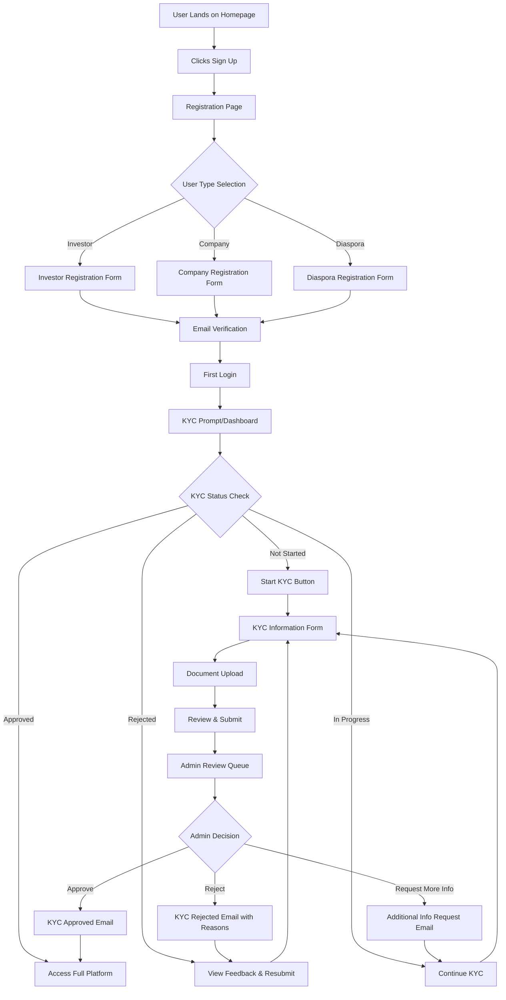

# NepEx Platform - Page Structure & KYC Flow

## Page Hierarchy

### 1. Public Pages (No Authentication Required)
```
/                          # Landing page
/about                     # About NepEx
/how-it-works             # Platform explanation
/education                # Educational hub
  /education/pre-ipo-basics    # Pre-IPO investment basics
  /education/spv-model        # SPV model explanation
  /education/risks            # Risk disclosure
  /education/guides           # Investment guides
/faqs                     # Frequently asked questions
/contact                  # Contact information
/terms                    # Terms and conditions
/privacy                  # Privacy policy
```

### 2. Authentication Pages
```
/signup                   # New user registration
/login                    # User login
/forgot-password         # Password recovery
/reset-password          # Password reset (with token)
/verify-email            # Email verification
```

### 3. KYC Pages (Authenticated Users)
```
/kyc                      # KYC dashboard/overview
/kyc/form                # KYC information form
/kyc/documents           # Document upload interface
/kyc/status              # KYC application status
/kyc/resubmit           # Resubmission for rejected KYC
```

### 4. Investor Pages (KYC Approved)
```
/dashboard               # Investor dashboard
/offerings               # Browse investment opportunities
/offerings/:id           # Individual offering details
/invest/:offeringId      # Investment flow
/portfolio               # Investment portfolio
/portfolio/:investmentId # Individual investment details
/transactions            # Transaction history
/notifications           # Notification center
/settings                # Profile settings
  /settings/profile      # Personal information
  /settings/security     # Security settings
  /settings/banking      # Bank account details
  /settings/preferences  # Notification preferences
```

### 5. Company Pages (Company Representatives)
```
/company/dashboard       # Company dashboard
/company/profile         # Company profile management
/company/verification    # Company verification status
/company/offerings       # Manage offerings
/company/offerings/new   # Create new offering
/company/offerings/:id   # Edit offering
/company/investors       # View investors
/company/reports         # Company reports
```

### 6. Admin Pages (Platform Administrators)
```
/admin                   # Admin dashboard
/admin/kyc               # KYC management
/admin/kyc/:userId       # Individual KYC review
/admin/companies         # Company management
/admin/companies/:id     # Individual company review
/admin/offerings         # Offering management
/admin/offerings/:id     # Individual offering review
/admin/users             # User management
/admin/users/:id         # Individual user details
/admin/transactions      # Transaction monitoring
/admin/spv               # SPV management
/admin/reports           # Platform reports
/admin/compliance        # Compliance dashboard
/admin/settings          # Platform settings
```

## KYC Flow Details

### User Registration to KYC Approval Flow



### KYC Form Fields

#### Personal Information Section
- Full Name (as per citizenship/passport)
- Date of Birth
- Gender
- Father's Name
- Mother's Name
- Spouse's Name (if applicable)
- Citizenship/Passport Number
- Issue Date and Place
- Phone Number (primary)
- Phone Number (secondary)
- Email Address

#### Address Information
- Permanent Address
  - Province
  - District
  - Municipality/VDC
  - Ward Number
  - Tole/Street
- Current Address (if different)
- Mailing Address preference

#### Financial Information
- Occupation
- Employer Name
- Annual Income Range
- Source of Funds
- Bank Account Details
- Investment Experience Level

#### For Diaspora Investors
- Country of Residence
- Visa Status
- NRN ID Number (if applicable)
- Remittance Partner Preference

### Document Requirements

#### Required Documents
1. **Citizenship/Passport** (front and back)
2. **Recent Photograph** (passport size)
3. **Signature Specimen**

#### Optional/Conditional Documents
1. **Address Proof** (if current address differs)
2. **Bank Statement** (last 3 months)
3. **Income Certificate** (for high-value investments)
4. **NRN Card** (for diaspora investors)

### KYC Status States

1. **NOT_STARTED** - User registered but hasn't begun KYC
2. **DRAFT** - KYC form partially filled
3. **DOCUMENTS_PENDING** - Form complete, documents pending
4. **SUBMITTED** - All information submitted, awaiting review
5. **UNDER_REVIEW** - Admin actively reviewing
6. **ADDITIONAL_INFO_REQUIRED** - Admin requested more information
7. **APPROVED** - KYC approved, full access granted
8. **REJECTED** - KYC rejected with reasons
9. **EXPIRED** - KYC approval expired (after set period)

### Admin KYC Review Interface

#### Review Dashboard
- Queue of pending KYC applications
- Filters by status, date, user type
- Quick stats (pending, approved today, etc.)

#### Individual Review Page
- User information display
- Document viewer (with zoom, rotate)
- Verification checklist
- Previous submission history
- Communication log
- Action buttons:
  - Approve
  - Reject (with reason selection)
  - Request More Information
  - Flag for Senior Review

#### Rejection Reasons (Standardized)
- Invalid/Unclear citizenship document
- Photograph doesn't meet requirements
- Information mismatch
- Incomplete documentation
- Failed identity verification
- Suspicious activity detected
- Document expired
- Other (with text field)

### Post-KYC Features

Once KYC is approved, users gain access to:
- Browse and view detailed investment opportunities
- Make investments (with amount based on KYC tier)
- Access portfolio management
- Download investment certificates
- Participate in investor communications
- Access educational resources

### KYC Compliance Features

1. **Audit Trail** - All KYC actions logged with timestamp and user
2. **Document Encryption** - All uploaded documents encrypted at rest
3. **Access Control** - Only authorized admins can view KYC data
4. **Expiry Management** - Automatic alerts for expiring documents
5. **Reporting** - SEBON compliance reports generation
6. **Data Retention** - Automatic archival per regulatory requirements

## Technical Implementation Notes

### Route Protection
- Public routes: No authentication required
- Auth routes: Redirect to dashboard if logged in
- KYC routes: Require authentication, show based on KYC status
- Investor routes: Require completed KYC
- Company routes: Require company role
- Admin routes: Require admin role

### State Management
- User authentication state (Supabase Auth)
- KYC status (stored in user profile)
- Role-based access control
- Document upload progress
- Form validation states

### Security Considerations
- All KYC pages served over HTTPS
- Document uploads go directly to Supabase Storage
- Sensitive data never stored in localStorage
- Session timeout for inactive users
- Rate limiting on document uploads
- CAPTCHA on public forms